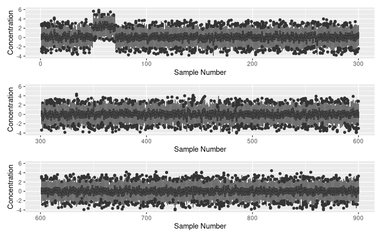
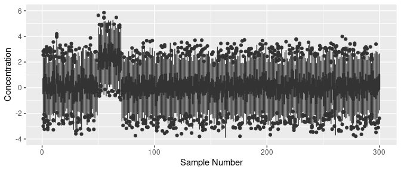
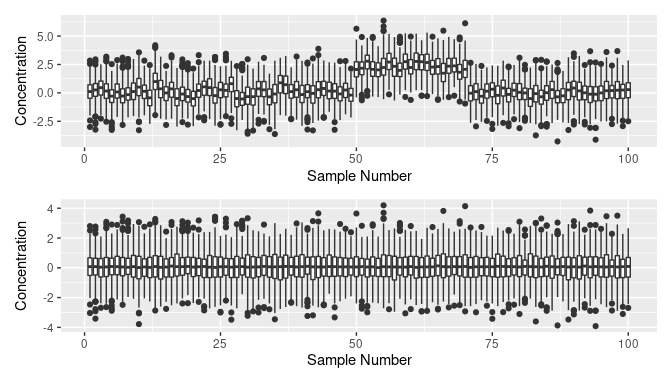
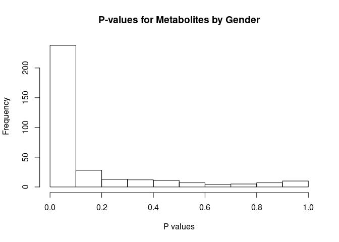
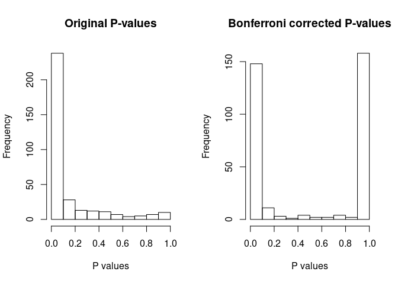
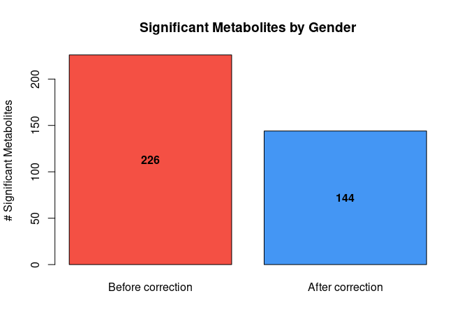
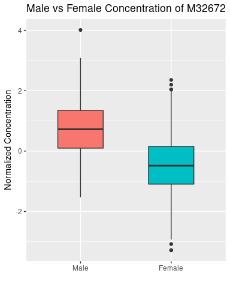
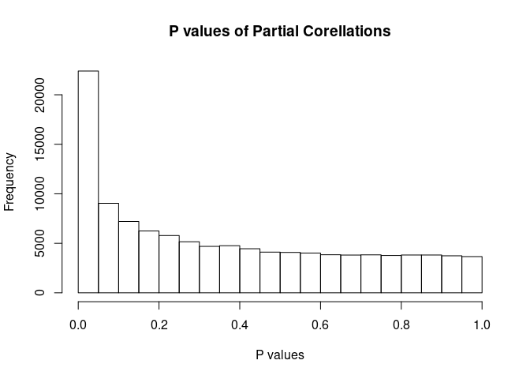
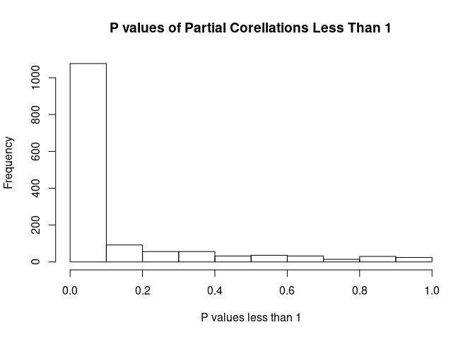

# **Introduction to Metabolomics**


A report by **Jake Sauter** and **Nick Bartelo**

date: 2/19/2021


https://raw.githubusercontent.com/jakesauter/metabolomics_hw_1/main/imgs/graph.png


## **1. Data Preprocessing**

### **1.1 Loading Data**


```r
library(magrittr)

data_dir <- "/home/x1/Documents/Weill_Cornell/Functional_Interpretation/metabolomics/homework_1/data/"

data_filename <- list.files(data_dir, "Simulated_metabolomics_data.RData", 
                            full.names = TRUE)
data_filename %<>% normalizePath(mustWork=TRUE)
data_env <- new.env()
load(data_filename, envir = data_env)
ls(data_env)
```

```
## [1] "annotations" "dat"         "gender"
```

We see that there are three objects loaded into the `data_env` 
environment from this data file. Let us first check the type 
and dimensionality of each of these new variables.

* **Gender** is represented by a coding of 1 (male) and 2 (female)
* **Annotations** include the name of the metabolites and their corresponding super pathways, sub pathways, and their formal names (title)
* **Matrix dat** contains the metabolic numerical data


```r
str(data_env$gender)
```

```
##  int [1:906] 1 1 2 1 1 2 2 1 1 2 ...
```


```r
str(data_env$annotations)
```

```
## Classes 'data.table' and 'data.frame':	335 obs. of  4 variables:
##  $ name         : chr  "M20675" "M34400" "M33228" "M35186" ...
##  $ Super_pathway: chr  "Carbohydrate" "Xenobiotics" "Lipid" "Lipid" ...
##  $ Sub_pathway  : chr  "Glycolysis, Gluconeogenesis, and Pyruvate Metabolism" "Xanthine Metabolism" "Lysolipid" "Lysolipid" ...
##  $ Label        : chr  "1,5-anhydroglucitol (1,5-AG)" "1,7-dimethylurate" "1-arachidonoylglycerophosphocholine (20:4n6)*" "1-arachidonoylglycerophosphoethanolamine*" ...
##  - attr(*, ".internal.selfref")=<externalptr>
```


```r
str(data_env$dat)
```

```
##  num [1:906, 1:335] 0.838 1.566 2.475 1.874 1.154 ...
##  - attr(*, "dimnames")=List of 2
##   ..$ : NULL
##   ..$ : chr [1:335] "M20675" "M34400" "M33228" "M35186" ...
##  - attr(*, "scaled:center")= Named num [1:335] -0.01605 -0.45303 -0.00649 0.0208 0.00487 ...
##   ..- attr(*, "names")= chr [1:335] "M20675" "M34400" "M33228" "M35186" ...
##  - attr(*, "scaled:scale")= Named num [1:335] 0.453 1.019 0.525 0.377 0.444 ...
##   ..- attr(*, "names")= chr [1:335] "M20675" "M34400" "M33228" "M35186" ...
```

### **1.2 Checking Data Quality**

We first check overall metabolite measurement levels between the samples
to ensure that there are no **batch effects** or experimental abnormalities.

* **Batch effects** occur in experiments when non-biological factors change the data produced by the experiment, leading to inaccurate conclusions. An example could be the results of an experiment in which more starting material is being used for certain samples on accident than the others.

* We note that it is commonly accepted to **log** biological data before 
interpretation as this usually results in **normally distributed** data. Therefore, we take the logarithm with base e of the data.

Below we plot boxplots of the data for every sample in blocks of 300 samples in order to show any differences more clearly. 

* We clearly see a pronounced **upregulation within the first 300 samples**.


```r
df <- 
  data_env %>%
  .$dat %>% 
  log() %>% 
  as.data.frame() %>% 
  mutate(sample_num = row_number()) %>% 
  pivot_longer(-c(sample_num), 
               names_to='metabolite', values_to="concentration")

plot_list <- vector('list', 3)
for (group_num in 1:3) {
  first_sample <- 1 + (300 * (group_num - 1))
  last_sample <- 300 * (group_num - 1) + 300

  plot_list[[group_num]] <- df %>% 
    filter(sample_num >= first_sample, 
           sample_num <= last_sample) %>% 
    ggplot() + 
      geom_boxplot(aes(x=sample_num, 
                       y=concentration, 
                       group=sample_num)) + 
      ylim(c(-4, 6)) +
      xlab("Sample Number") + 
      ylab("Concentration")

}

plot_list[[1]] / plot_list[[2]] / plot_list[[3]]
```

<!-- -->

**What do you observe? What possible reasons could there be? Tip: Omics data should always be logged before visualization.**


Below we more closely visualize those samples that appear to have higher measurement
levels all-around on all of the studied metabolites.

* Samples from about **50 to 70** all have much higher concentrations than the remaining samples
* Indicative of a possible **batch effect**
* Solved by **quotient normalization**


```r
plot_list[[1]]
```

<!-- -->

### **1.3 Quotient Normalization**

Quotient Normalization - Procedure which assumes that changes in the concentrations of single analytes only influence parts of the spectra, whereas changes of the overall concentration of a sample influence the complete spectrum.

* Assumption that allows for quotient normalization to work is that the **true mean ratio is actually 1** and thus the same degree of up- and down-regulation is expected.

**Steps for Quotient Normalization**:

* Calculate the median sample
* For Each Sample: 
  + Calculate the quotient of every metabolite concentration level with respect to the median sample 
  + Determine the median metabolite quotient (*MMQ*)
  + Divide the concentration of all metabolites in the sample by the *MMQ*

Below we apply quotient normalization to the data. 


```r
median_sample <- apply(data_env$dat, 2, median)
normalized_dat <- data_env$dat 

for (i in 1:nrow(normalized_dat)) {
  quotient <- data_env$dat[i,] / median_sample
  median_quotient <- median(quotient)
  normalized_dat[i,] = data_env$dat[i,] / median_quotient
}
```


* We plot the original data before quotient normalization and the normalized data after its application. 
* Results show the previous up-regulated samples now inline with the other samples. 
* We have accounted for the batch effect seen previously and can now continue with statistical analyses of the data.


```r
library(tidyverse)
library(patchwork)

df_before <- 
  data_env %>% 
  .$dat %>%
  .[1:100, ] %>% 
  log() %>% 
  as.data.frame() %>% 
  mutate(sample_num = row_number()) %>% 
  pivot_longer(-c(sample_num), 
               names_to='metabolite', values_to="concentration")
p1 <- 
  df_before %>% 
  ggplot() + 
        geom_boxplot(aes(x=sample_num, 
                         y=concentration, 
                         group=sample_num)) + 
  xlab("Sample Number") + 
  ylab("Concentration")


df_after <- 
  normalized_dat %>%
  .[1:100, ] %>% 
  log() %>% 
  as.data.frame() %>% 
  mutate(sample_num = row_number()) %>% 
  pivot_longer(-c(sample_num), 
               names_to='metabolite', values_to="concentration")

p2 <- 
  df_after %>% 
  ggplot() + 
        geom_boxplot(aes(x=sample_num, 
                         y=concentration, 
                         group=sample_num)) +
  xlab("Sample Number") + 
  ylab("Concentration")

p1 / p2
```

<!-- -->


## **2. Phenotype association**

### **2.1 Male vs Female **

First, we ask R for information about the t-test function. This code tells us the parameters and specifications about how to run a `t.test` in R.

For each **metabolite**, we will be performing a t-test
between the measured concentration levels between groups split
between the genders.

We will be performing these test on the **normalized**, 
and **logged** data. Below we take the logarithm of the normalized data.


```r
log_norm_dat <- log(normalized_dat)
```

Now we can perform a `t.test` for each metabolite.

* We group data values based on if they come from **males or females**. 
* Using this grouped information, it is possible to run a **two sample independent t-test** for all metabolites. This test is justified because we have shown the data to be **normally distributed** and it is true that **each sample is independent** of all others in the study. 
* We plot the distribution of p-values resulting from the tests for each sample below. 
* We find that a **great majority initially are very small**, before accounting for the multiple testing correction.


```r
args(stats:::t.test.default)
```

```
## function (x, y = NULL, alternative = c("two.sided", "less", "greater"), 
##     mu = 0, paired = FALSE, var.equal = FALSE, conf.level = 0.95, 
##     ...) 
## NULL
```


```r
metabolites <- colnames(log_norm_dat)

p_vals <- vector('double', length(metabolites))
names(p_vals) <- metabolites

for (metabolite in metabolites) {
  male   <- log_norm_dat[data_env$gender==1, metabolite]
  female <- log_norm_dat[data_env$gender==2, metabolite]
  p_vals[metabolite] <- t.test(male, female)$p.value
}

hist(p_vals, 
     main='P-values for Metabolites by Gender', 
     xlab='P values')
```

<!-- -->

### **2.2 Multiple Testing Correction**

**What do you observe? Perform multiple testing correction with a method and α of your choice.**

* Multiple testing correction problem - When multiple statistical tests are run, the occurrence of false positives for each test is equal to the significance level set prior to the statistical analysis. When performing n tests, we need to account for the probability of receiving false positives for all n tests, not just one.
* We set our **significance level to 0.05** for our tests. 
* Bonferroni correction divides the significance level by the number of tests, resulting in an adjusted significance level. 
* The `p.adjust()` function in R sets this Bonferroni correction. 
* Histogram of the original p-values from the statistical tests without the Bonferroni correction and histogram of the p-values after the Bonferroni correction show **much fewer small p-values than without the correction**.  


```r
args(p.adjust)
```

```
## function (p, method = p.adjust.methods, n = length(p)) 
## NULL
```


```r
adj_p_vals <- p.adjust(p_vals, 'bonferroni')

par(mfrow = c(1, 2))

hist(p_vals, 
     main='Original P-values', 
     xlab='P values')

adj_p_vals <- p.adjust(p_vals, 'bonferroni')
hist(adj_p_vals, 
     main='Bonferroni corrected P-values', 
     xlab='P values')
```

<!-- -->


**How many metabolites are significantly associated with gender before and after multiple testing correction?**

* 226 significant metabolites **before Bonferroni correction**
* 144 significant metabolites **after Bonferroni correction**


```r
before <- length(which(p_vals < 0.05))
after <- length(which(adj_p_vals < 0.05))
bp <- barplot(c(before, after), 
        main = "Significant Metabolites by Gender", 
        ylab = "# Significant Metabolites", 
        names.arg = c('Before correction', 'After correction'), 
        col = c("#f45044", "#4496f4"))

text(bp, c(before,after)/2, labels = c(before,after), font = 2)
```

<!-- -->


### **2.3 Top 10 Metabolites by Gender**

**Which 10 metabolites are most significantly associated with gender? Which pathways do these metabolites belong to?**

Below we show the **top 10 metabolites** associated with gender by finding the metabolites with the **smallest p-values** after the Bonferroni correction.


```r
library(knitr)
sorted_p_vals <- sort(adj_p_vals)[1:10]
top_ten <- names(sorted_p_vals)

rownames(data_env$annotations) <- colnames(log_norm_dat)
data_env$annotations[top_ten, ] %>% 
  as.data.frame() %>% 
  mutate(p_val = sorted_p_vals[1:10], .after=name) %>% 
  kable()
```


|       |name   | p_val|Super_pathway |Sub_pathway                               |Label                                        |
|:------|:------|-----:|:-------------|:-----------------------------------------|:--------------------------------------------|
|M32672 |M32672 |     0|Amino Acid    |Glutamate Metabolism                      |pyroglutamine*                               |
|M18369 |M18369 |     0|Peptide       |Gamma-glutamyl Amino Acid                 |gamma-glutamylleucine                        |
|M32418 |M32418 |     0|Lipid         |Long Chain Fatty Acid                     |myristoleate (14:1n5)                        |
|M33447 |M33447 |     0|Lipid         |Long Chain Fatty Acid                     |palmitoleate (16:1n7)                        |
|M27718 |M27718 |     0|Amino Acid    |Creatine Metabolism                       |creatine                                     |
|M37190 |M37190 |     0|Lipid         |Steroid                                   |5alpha-androstan-3beta,17beta-diol disulfate |
|M1125  |M1125  |     0|Amino Acid    |Leucine, Isoleucine and Valine Metabolism |isoleucine                                   |
|M43488 |M43488 |     0|Peptide       |Dipeptide Derivative                      |N-acetylcarnosine                            |
|M34456 |M34456 |     0|Peptide       |Gamma-glutamyl Amino Acid                 |gamma-glutamylisoleucine*                    |
|M33968 |M33968 |     0|Lipid         |Medium Chain Fatty Acid                   |5-dodecenoate (12:1n7)                       |

**Visualize the differences between male and female for the top hit.**

Below we create boxplots showing the data for the top hit, metabolite **M32672**, which has the most significant association with gender

* **Mean concentration** of the metabolite is **much greater in males than that of females**.


```r
top_hit <- names(sort(adj_p_vals)[1])

male <- log_norm_dat[data_env$gender==1, top_hit]
female <- log_norm_dat[data_env$gender==2, top_hit]

male <- c(male, rep(NA, length(female) - length(male)))

df <- 
  data.frame(Male=male, 
             Female=female) %>%
  mutate(index = row_number()) %>% 
  pivot_longer(-c(index), 
               names_to='gender', values_to="concentration") %>% 
  mutate(gender = factor(gender, levels = c('Male', 'Female')))
  


df %>% 
  ggplot() + 
  geom_boxplot(aes(x=gender, 
                   y=concentration, 
                   fill=gender),
                width = 0.5
               ) + 
  theme(legend.position = "none") + 
  labs(title=paste('Male vs Female Concentration of', top_hit)) + 
  xlab("") + 
  ylab("Normalized Concentration")
```

<!-- -->


## **3 Gaussian Graphical Model (GGM)**

### **3.1 Partial Correlations and P-Values**

Below we show that we can use the **R package ppcor** to create a Gaussian Graphical Model. First, we use the function `pcor` to calculate the partial correlations and their p-values. 

* We create a **histogram of the p-values of partial correlations**


```r
pcor <- ppcor::pcor(log_norm_dat)
names(pcor)
```

```
## [1] "estimate"  "p.value"   "statistic" "n"         "gp"        "method"
```


```r
p_vals <- pcor$p.value
hist(p_vals, 
     main = "P values of Partial Corellations", 
     xlab = "P values")
```

<!-- -->


### **3.2 Bonferroni Correction**

**Perform multiple testing correction with Bonferroni correction. When calculating the number of tests, remember that a correlation matrix is symmetric and the diagonal does not count (calculate how many values there are in a correlation matrix). Set all insignificant values and the in the partial correlation matrix to zero.**

To perform multiple testing correction using the Bonferroni method, we can not use the built in R function since we have a matrix. Therefore, we need to calculate the total number of tests we will run so that we can divide the significance level. 

* The calculation of the **number of tests** is the number of columns in the matrix, denoted n, multiplied by (n-1) and divided by 2. 
* Output histogram of the p-values of partial correlations **after Bonferroni correction**.


```r
n <- ncol(log_norm_dat)
n_tests <- (n*(n-1))/2 

adj_p_vals <- p_vals * n_tests
adj_p_vals[adj_p_vals > 1] = 1

hist(adj_p_vals[adj_p_vals < 1], 
     main = "P values of Partial Corellations Less Than 1", 
     xlab = "P values less than 1")
```

<!-- -->

Below we set the insignificant values and the diagonal values to 0 in order to visualize the GGM.


```r
adj_mat <- pcor$estimate
adj_mat[adj_p_vals > 0.05] = 0

for (i in 1:nrow(adj_mat)) {
  adj_mat[i, i] = 0
}

colnames(adj_mat) <- colnames(log_norm_dat)
rownames(adj_mat) <- colnames(log_norm_dat)
```


### **3.3 Visualizing the GGM** 

**This matrix is the adjacency matrix of the underlying Gaussian graphical model. Visualize the network using the igraph package (tip: graph.adjacency function).**

Below we **keep all nonzero metabolites** that we have found to be significant.


```r
# Assemble the non-zero matrix
nonzero_metabolites <- c()

for (metabolite in colnames(adj_mat)) {
  if (any(adj_mat[metabolite, ] != 0) |
      any(adj_mat[, metabolite] != 0)) {
     nonzero_metabolites %<>% append(metabolite)
  }
}

adj_mat <- adj_mat[nonzero_metabolites, nonzero_metabolites]
```

Below we import the **igraph library** and **set parameters**.


```r
library(igraph) 

graph <- graph.adjacency(adj_mat, 
                         weighted = TRUE, 
                         diag = FALSE, 
                         mode = 'directed')
```

Finally, the final parameters are set below to create the resulting GGM below.

* Each metabolite is represented by a node.
* The more connections with other metabolites, the larger the node
* The three metabolites shown are the largest 3 nodes, i.e., they have the most connections


```r
V(graph)$size <- degree(graph)
V(graph)$name[degree(graph) < 15] <- ""


png('graph.png',
    width  = 700,
    height = 700)

par(mai=c(0,0,1,0))

plot(graph, 
     layout=layout_with_dh(graph), 
     edge.arrow.size = 0.3, 
     vertex.label.font = 2, 
     vertex.label.cex = 0.9, 
     vertex.frame.color = 'darkslategrey')

dev.off()
```


**Brief pathway analysis of high degree vertices**


```r
degree(graph) %>% 
  table() 
```

```
## .
##  2  4  6  8 10 12 14 16 22 
## 92 74 47 24 19 10  3  2  1
```


```r
names <- colnames(adj_mat)
degrees <- degree(graph)
sorted_degrees <- sort(degrees, decreasing = TRUE)

sorted_by_degree <- 
  sort(degrees, 
       decreasing = TRUE)

high_degree_metabolites <- names(sorted_by_degree[1:10])

data_env %>% 
  .$annotations %>% 
  .[high_degree_metabolites,] %>% 
  as.data.frame() %>% 
  mutate(degree=sorted_degrees[1:10], .after=name) %>% 
  kable()
```


|       |name   | degree|Super_pathway |Sub_pathway                            |Label                                            |
|:------|:------|------:|:-------------|:--------------------------------------|:------------------------------------------------|
|M1110  |M1110  |     22|Lipid         |Polyunsaturated Fatty Acid (n3 and n6) |arachidonate (20:4n6)                            |
|M33822 |M33822 |     16|Lipid         |Lysolipid                              |1-docosahexaenoylglycerophosphocholine (22:6n3)* |
|M1336  |M1336  |     16|Lipid         |Long Chain Fatty Acid                  |palmitate (16:0)                                 |
|M34419 |M34419 |     14|Lipid         |Lysolipid                              |1-linoleoylglycerophosphocholine (18:2n6)        |
|M35257 |M35257 |     14|Lipid         |Lysolipid                              |2-linoleoylglycerophosphocholine*                |
|M19323 |M19323 |     14|Lipid         |Polyunsaturated Fatty Acid (n3 and n6) |docosahexaenoate (DHA; 22:6n3)                   |
|M35186 |M35186 |     12|Lipid         |Lysolipid                              |1-arachidonoylglycerophosphoethanolamine*        |
|M44562 |M44562 |     12|Lipid         |Lysolipid                              |1-linolenoylglycerophosphocholine (18:3n3)*      |
|M45453 |M45453 |     12|Lipid         |Lysolipid                              |1-myristoylglycerophosphocholine (14:0)          |
|M33230 |M33230 |     12|Lipid         |Lysolipid                              |1-palmitoleoylglycerophosphocholine (16:1)*      |

